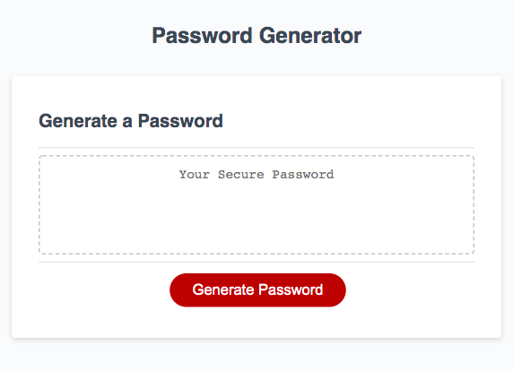

# Password Generator Starter Code

This is Javascript powered application that users can use to generate a random password based on criteria they’ve selected including password length, uppercase, lowercases, numbers and symbols.

* When clicking the Generate Password button, user will be prompted the password length.
* Then user will be asked if they want to use lowercase, uppercase, number, and symbol to create the password.
* Based on their answer, a random password will be generated that meets their criteria.
* The generated password will be written in the password box.

# Screenshot

    </img> 

# Link to deployed application: 
https://minhhap.github.io/horiseon/

# Link to GitHub repo
https://github.com/minhhap/password-generator